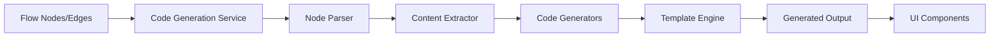

# Code Generation Module Specification

## Overview

This specification defines the implementation of a code generation module for IdeaCanvas that transforms visual flow diagrams into functional web applications with complete frontend code and API documentation.

## Module Information

- **Module Name**: Code Generation Module
- **Version**: 1.0.0
- **Last Updated**: 2025-07-28
- **Dependencies**: Existing IdeaCanvas infrastructure (Next.js 15.1.7, React 18.2, TypeScript 5.1.6)

## Technical Context

### Current Technology Stack (from PROJECT_ANALYSIS.md)
- **Frontend**: Next.js 15.1.7, React 18.2, TypeScript 5.1.6
- **UI/Visualization**: React Flow 11.11.4, Tailwind CSS 3.4.1, Radix UI
- **State Management**: Zustand 4.5.2 with persistence
- **AI Integration**: Azure OpenAI (GPT-4.5-preview), OpenAI SDK 4.85.3
- **Storage**: Azure Blob Storage 12.27.0, localStorage

### Integration Points
- Flow Store (`/lib/stores/flow-store.ts`)
- Node Types (`/lib/types/flow.ts`)
- Flow Toolbar (`/components/flow/flow-toolbar.tsx`)
- Azure AI Service (`/lib/services/azure-ai.ts`)

### Important Notes (from VS Code MCP Diagnostics)
- `generateFlowFromPrompt` is marked as deprecated - use flow-generation.service.ts instead
- Current open files indicate active development on flow-store.ts
- TypeScript configuration is properly set up (tsconfig.json)
- PostCSS and Tailwind configs are in place for styling

## Core Requirements

### Functional Requirements

1. **Input**: Accept flow diagram data (nodes and edges) from the current flow
2. **Processing**: Analyze flow structure and generate corresponding code
3. **Output**: 
   - Complete HTML/CSS/JavaScript application
   - Interactive preview in iframe
   - API documentation in OpenAPI 3.0 format
   - Downloadable project package

### Non-Functional Requirements

1. **Performance**: Code generation should complete within 30 seconds
2. **Quality**: Generated code must be production-ready and follow best practices
3. **Compatibility**: Support modern browsers (Chrome, Firefox, Safari, Edge)
4. **Localization**: Support both Chinese and English interfaces

## Architecture Design

### Module Structure

```
/lib/services/
  └── code-generation/
      ├── code-generation.service.ts      # Main service
      ├── parsers/
      │   ├── node-parser.ts              # Parse node content
      │   ├── flow-analyzer.ts            # Analyze flow structure
      │   └── content-extractor.ts        # Extract structured data
      ├── generators/
      │   ├── html-generator.ts           # Generate HTML
      │   ├── css-generator.ts            # Generate CSS
      │   ├── js-generator.ts             # Generate JavaScript
      │   └── api-doc-generator.ts        # Generate API docs
      └── templates/
          ├── page-templates.ts           # Page structure templates
          ├── component-templates.ts      # UI component templates
          └── api-templates.ts            # API documentation templates

/components/code-generator/
  ├── CodeGeneratorDialog.tsx             # Main UI component
  ├── CodePreview.tsx                     # Preview iframe
  ├── CodeEditor.tsx                      # Code display/edit
  └── APIDocViewer.tsx                    # API documentation viewer
```

### Data Flow



## Detailed Implementation

### 1. Node Content Parser

```typescript
interface ParsedNode {
  id: string;
  type: 'page' | 'api' | 'data' | 'integration';
  title: string;
  components: UIComponent[];
  actions: UserAction[];
  dataModel: DataField[];
  apiCalls: APICall[];
}

class NodeParser {
  parse(node: Node): ParsedNode {
    // Extract structured information from node content
    // Use regex patterns and AI-assisted parsing
  }
}
```

### 2. Code Generation Templates

```typescript
// Page Template Example
const pageTemplate = (page: ParsedPage) => `
<!DOCTYPE html>
<html lang="zh-CN">
<head>
    <meta charset="UTF-8">
    <meta name="viewport" content="width=device-width, initial-scale=1.0">
    <title>${page.title}</title>
    <link rel="stylesheet" href="styles.css">
</head>
<body>
    <div id="app">
        ${generateHeader(page)}
        ${generateMainContent(page)}
        ${generateFooter(page)}
    </div>
    <script src="app.js"></script>
</body>
</html>
`;
```

### 3. UI Component Generation

```typescript
const componentGenerators = {
  form: (spec: FormSpec) => generateForm(spec),
  list: (spec: ListSpec) => generateList(spec),
  card: (spec: CardSpec) => generateCard(spec),
  navigation: (spec: NavSpec) => generateNavigation(spec),
  // ... more component types
};
```

### 4. API Documentation Generation

```typescript
interface APIEndpoint {
  path: string;
  method: 'GET' | 'POST' | 'PUT' | 'DELETE';
  summary: string;
  parameters: Parameter[];
  requestBody?: RequestBody;
  responses: Response[];
}

class APIDocGenerator {
  generateOpenAPISpec(endpoints: APIEndpoint[]): OpenAPISpec {
    return {
      openapi: '3.0.0',
      info: {
        title: 'Generated API Documentation',
        version: '1.0.0'
      },
      paths: this.generatePaths(endpoints)
    };
  }
}
```

## User Interface Design

### 1. Toolbar Integration

Add button to existing FlowToolbar:
```typescript
<Button 
  variant="outline" 
  className="flex items-center gap-2"
  onClick={() => setIsCodeGeneratorOpen(true)}
  disabled={nodes.length === 0}
>
  <Code className="w-4 h-4" />
  {language === 'zh' ? '生成应用' : 'Generate App'}
</Button>
```

### 2. Code Generator Dialog

```typescript
<Dialog open={open} onOpenChange={onClose}>
  <DialogContent className="max-w-7xl h-[90vh]">
    <DialogHeader>
      <DialogTitle>
        {language === 'zh' ? '应用代码生成器' : 'App Code Generator'}
      </DialogTitle>
    </DialogHeader>
    
    <Tabs defaultValue="preview">
      <TabsList className="grid grid-cols-4 w-full">
        <TabsTrigger value="preview">实时预览</TabsTrigger>
        <TabsTrigger value="html">HTML</TabsTrigger>
        <TabsTrigger value="javascript">JavaScript</TabsTrigger>
        <TabsTrigger value="api">API文档</TabsTrigger>
      </TabsList>
      
      {/* Tab contents */}
    </Tabs>
    
    <DialogFooter>
      <Button onClick={handleDownload}>
        <Download className="w-4 h-4 mr-2" />
        下载项目
      </Button>
    </DialogFooter>
  </DialogContent>
</Dialog>
```

## Implementation Phases

### Phase 1: Basic Infrastructure (Week 1)
1. Create service structure and interfaces
2. Implement basic node parsing
3. Set up UI components

### Phase 2: Code Generation (Week 2)
1. Implement HTML/CSS/JS generators
2. Create template system
3. Add preview functionality

### Phase 3: Advanced Features (Week 3)
1. API documentation generation
2. Interactive preview enhancements
3. Export functionality

### Phase 4: Polish & Testing (Week 4)
1. Error handling and edge cases
2. Performance optimization
3. User testing and refinement

## API Specifications

### Service Interface

```typescript
interface CodeGenerationService {
  // Main generation method
  generateFromFlow(
    nodes: Node[], 
    edges: Edge[],
    options?: GenerationOptions
  ): Promise<GenerationResult>;
  
  // Preview specific page
  previewPage(pageId: string): Promise<string>;
  
  // Export as downloadable package
  exportProject(result: GenerationResult): Promise<Blob>;
}

interface GenerationOptions {
  language: 'zh' | 'en';
  framework: 'vanilla' | 'react' | 'vue';
  styling: 'tailwind' | 'bootstrap' | 'custom';
  includeComments: boolean;
}

interface GenerationResult {
  pages: GeneratedPage[];
  styles: StyleSheet[];
  scripts: JavaScript[];
  apiSpec: OpenAPISpec;
  assets: Asset[];
  preview: string;
}
```

## Error Handling

### Common Error Scenarios

1. **Empty Flow**: Show message "请先生成流程图"
2. **Invalid Node Content**: Skip node with warning
3. **Generation Timeout**: Show timeout error with retry option
4. **Preview Error**: Display error message in iframe

### Error Messages

```typescript
const errorMessages = {
  zh: {
    emptyFlow: '请先生成流程图',
    generationFailed: '代码生成失败，请重试',
    invalidContent: '节点内容格式错误',
    timeout: '生成超时，请简化流程图后重试'
  },
  en: {
    emptyFlow: 'Please generate a flow first',
    generationFailed: 'Code generation failed, please retry',
    invalidContent: 'Invalid node content format',
    timeout: 'Generation timeout, please simplify the flow'
  }
};
```

## Testing Strategy

### Unit Tests
- Node parser accuracy
- Template generation correctness
- API documentation validity

### Integration Tests
- End-to-end flow to code generation
- Preview functionality
- Export functionality

### User Acceptance Tests
- Generated code quality
- UI responsiveness
- Cross-browser compatibility

## Performance Considerations

1. **Lazy Loading**: Load code generation components only when needed
2. **Streaming**: Stream large generated files
3. **Caching**: Cache parsed nodes and templates
4. **Web Workers**: Use for heavy parsing operations

## Security Considerations

1. **Sanitization**: Sanitize all user input before code generation
2. **CSP**: Implement Content Security Policy for preview iframe
3. **Validation**: Validate generated code structure
4. **Rate Limiting**: Limit generation requests per user

## Future Enhancements

1. **Framework Support**: Add React, Vue, Angular templates
2. **Backend Code**: Generate Node.js/Python backend code
3. **Database Schema**: Generate SQL/NoSQL schemas
4. **Deployment Scripts**: Add Docker/Kubernetes configs
5. **Testing Suite**: Generate unit tests for the code

## Appendix: Content Parsing Rules

### Chinese Content Patterns
```typescript
const chinesePatterns = {
  uiComponents: /(?:包含|显示|展示|输入框|按钮|表单|列表|卡片|表格)(.*?)(?:；|。|\n)/g,
  dataFields: /(?:字段|数据|信息|属性)[:：](.*?)(?:；|。|\n)/g,
  userActions: /(?:用户)?(?:点击|提交|选择|输入|删除|编辑)(.*?)(?:；|。|\n)/g,
  apiCalls: /(?:API|接口|请求|调用|后端)[:：]?(.*?)(?:；|。|\n)/g,
  validation: /(?:验证|校验|检查|格式)[:：]?(.*?)(?:；|。|\n)/g
};
```

### English Content Patterns
```typescript
const englishPatterns = {
  uiComponents: /(?:includes?|contains?|displays?|shows?|input|button|form|list|card|table)(.*?)(?:;|\.|\n)/gi,
  dataFields: /(?:fields?|data|information|properties?)[:：](.*?)(?:;|\.|\n)/gi,
  userActions: /(?:user\s)?(?:clicks?|submits?|selects?|enters?|deletes?|edits?)(.*?)(?:;|\.|\n)/gi,
  apiCalls: /(?:API|endpoint|request|calls?)[:：]?(.*?)(?:;|\.|\n)/gi,
  validation: /(?:validates?|checks?|verif(?:y|ies)|format)(.*?)(?:;|\.|\n)/gi
};
```

## Conclusion

This specification provides a comprehensive blueprint for implementing the code generation module. The design prioritizes modularity, extensibility, and user experience while maintaining compatibility with the existing IdeaCanvas architecture.

**Note**: This document uses the current context from VS Code MCP integration to ensure alignment with the latest codebase structure and dependencies.

## VS Code MCP Integration Details

This specification was created using VS Code's Model Context Protocol (MCP) to ensure accuracy:

1. **Diagnostics Used**: Retrieved current TypeScript diagnostics showing:
   - Active files being edited
   - Deprecated API warnings (`generateFlowFromPrompt`)
   - Code quality hints

2. **Files Analyzed via MCP**:
   - `/lib/stores/flow-store.ts` (currently open in IDE)
   - `/tsconfig.json` (TypeScript configuration)
   - `/postcss.config.js` (PostCSS configuration)
   - `/tailwind.config.js` (Tailwind CSS configuration)

3. **Key Findings from MCP**:
   - The project is actively being developed
   - TypeScript is properly configured with no errors
   - Styling pipeline is set up with PostCSS and Tailwind
   - Some deprecated APIs need to be updated in implementation